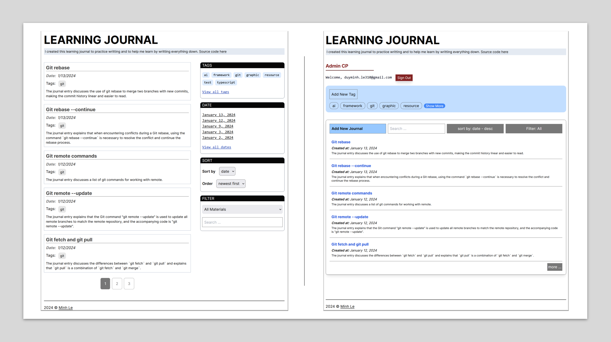

# LEARNING JOURNAL

This project is developed using React and TypeScript, and it's built on Next.js. It utilizes PostgreSQL as its database, employs Prisma for database management, Jest for testing purposes, and Tailwind CSS for styling. Designed as a learning journal, this application enables users to create and manage entries detailing their learning experiences. Each journal entry comprises a title, learning material, and personal notes. The learning material can be categorized into four types: quote, code, image, and link. The concept behind the app is to allow users to record interesting findings or new knowledge by quoting text, cropping screenshots, or copying links, and then to describe what they've learned in their own words.

Currently, the app is in the early stages of development and does not yet support multiple users. Those interested in using the application can do so by cloning the repository and running it locally, following the standard procedure for Next.js applications. Below are the installation instructions.

## Table of Contents

- [Back story](#back-story)
- [Tech stack](#tech-stack)
- [Screenshots](#screenshots)
- [Demo](#demo)
- [Installation](#installation)
- [Usage](#usage)
- [Contributing](#contributing)
- [License](#license)

## Back story

After ten years of living in the U.S., the author still finds himself struggling with speaking in English, especially when it comes to explaining something complex. He knows that the best way to improve anything is to practice. He starts to write down to explain anything he learned in his own words. Recently, he also realized that his brain can only process a small chunk of information at a time.

As a result, he created this web app to help him and anyone whose brain works like his. The main purpose of this app is not to document what you learn (well, you can do that if you want) but to help you learn by writing it down. You will recognize that when you see the live version on the author's website. There are topics, concepts, and information that have been repeated multiple times in different ways and different entries.

## Tech stack

- [React](https://reactjs.org/)
- [TypeScript](https://www.typescriptlang.org/)
- [Next.js](https://nextjs.org/)
- [Prisma](https://www.prisma.io/)
- [Jest](https://jestjs.io/)
- [Tailwind CSS](https://tailwindcss.com/)
- [OpenAI](https://openai.com/)
- [Supabase](https://supabase.io/)

## Screenshots



## Demo

You can see the demo at [https://learning-journal-drab.vercel.app/](https://learning-journal-drab.vercel.app/).
Admin login is at [https://learning-journal-drab.vercel.app/admin](https://learning-journal-drab.vercel.app/admin). You can log in with the email "demo@ledminh.dev" and password "demo_password_54321".

## Installation

1. Clone the repo

   ```sh
   git clone
   ```

2. Install NPM packages

   ```sh
   npm install
   ```

3. Create a `.env.local` file in the root directory and add the following environment variables

   ```sh
    OPENAI_API_KEY= # Get it from https://platform.openai.com/api_keys (after signning up for an account).
    NEXT_PUBLIC_SUPABASE_URL= # Get it from https://app.supabase.io/ (after signning up for an account and create your own organization and project).
    NEXT_PUBLIC_SUPABASE_ANON_KEY= # Get it from https://app.supabase.io/ (after signning up for an account and create your own organization and project).
    DATABASE_URL= # Get it from https://app.supabase.io/ (after signning up for an account and create your own organization and project).
    ADMIN_EMAIL= # Go to the authentication section of your supabase's project, create a new user with an email and add it here. You can only use this email to log in to the admin section for managing the journals on your app.

   ```

4. Setup the database

   ```sh
   npx prisma migrate dev --name init
   ```

5. Run the app

   ```sh
    npm run dev
   ```

6. Open [http://localhost:3000](http://localhost:3000) with your browser to see the result.

## Usage

After installing, go to [http://localhost:3000](http://localhost:3000) to see the app. Admin section can be accessed at [http://localhost:3000/admin](http://localhost:3000/admin). You can only login to the admin section with the email you added to the `ADMIN_EMAIL` environment variable.

## Contributing

Contributions are welcome! If you would like to contribute to this project, please follow these guidelines:

1. Fork the repository and create your branch from `main`.
2. Make your changes.
3. Submit a pull request with a clear description of your changes and why they should be merged.

Thank you for your contributions!

## License

This project is licensed under the GNU GPL License.
Please see the [LICENSE](./LICENSE) file for more details.
